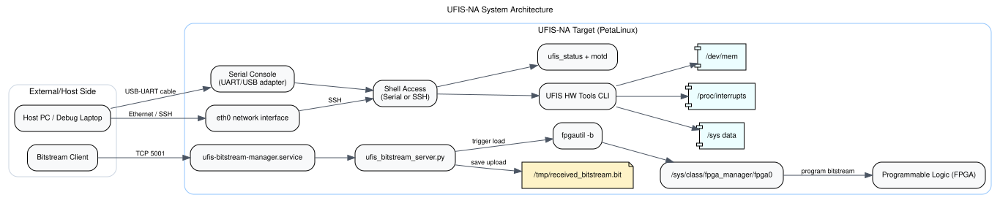
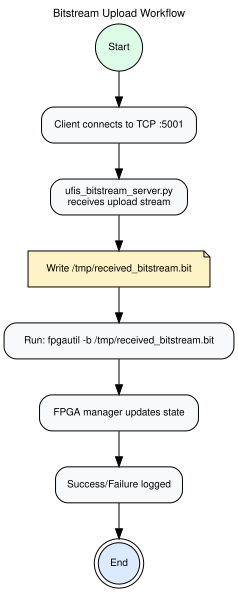
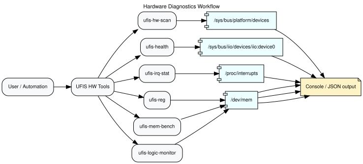
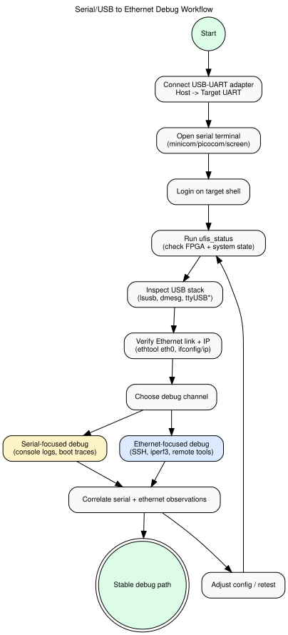
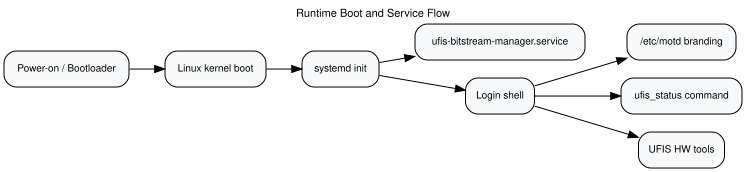

# UFIS-NA Architecture and Workflow Diagrams

All diagrams below are generated image assets from Graphviz DOT sources in:

- `docs/diagrams/src/*.dot`

Generated outputs:

- SVG: `docs/diagrams/svg/*.svg`
- PNG: `docs/diagrams/png/*.png`

## 1) System architecture

Shows external host interfaces, runtime services, FPGA programming path, and diagnostics data sources.



PNG fallback: [`diagrams/png/system_architecture.png`](diagrams/png/system_architecture.png)

## 2) Bitstream upload workflow

End-to-end flow from TCP upload to FPGA manager programming.



PNG fallback: [`diagrams/png/bitstream_upload_workflow.png`](diagrams/png/bitstream_upload_workflow.png)

## 3) Hardware diagnostics workflow

Maps UFIS diagnostic commands to Linux interfaces (`/sys`, `/proc`, `/dev/mem`) and outputs.



PNG fallback: [`diagrams/png/hw_diagnostics_workflow.png`](diagrams/png/hw_diagnostics_workflow.png)

## 4) Serial/USB to Ethernet debug workflow

Operational debug workflow from USB-UART bring-up to Ethernet path validation and iterative troubleshooting.



PNG fallback: [`diagrams/png/serial_usb_to_ethernet_debug.png`](diagrams/png/serial_usb_to_ethernet_debug.png)

## 5) Runtime boot and service workflow

Boot-to-shell path showing service startup, branding, and UFIS tools entry points.



PNG fallback: [`diagrams/png/runtime_boot_flow.png`](diagrams/png/runtime_boot_flow.png)

## Regenerating diagrams

From project root:

```bash
for f in docs/diagrams/src/*.dot; do
  b="$(basename "$f" .dot)"
  dot -Tsvg "$f" -o "docs/diagrams/svg/$b.svg"
  dot -Tpng "$f" -o "docs/diagrams/png/$b.png"
done
```
